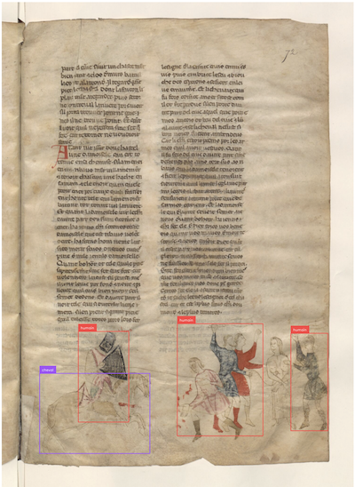

# Tutoriels PictorIA

Ce propose des tutoriels réalisés dans le cadre des activités du consortium Huma-Num [PictorIA](https://pictoria.hypotheses.org/).

## Détection d'objets avec Roboflow
[Slides](https://docs.google.com/presentation/d/1-a0tdgQRa2K5ESwN5IhTn8VnGtDaxeseK37TgvtaiHY/edit#)

Code :
- [inférence locale d'un modèle Roboflow](https://github.com/altomator/pictorIA/blob/main/python/test_inference.py)
- [conversion d'annotations au format IIIF]()

